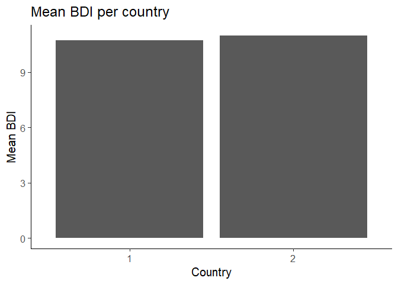
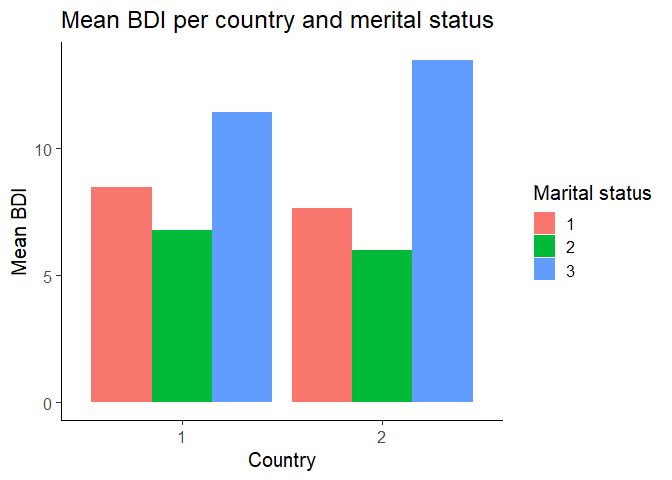
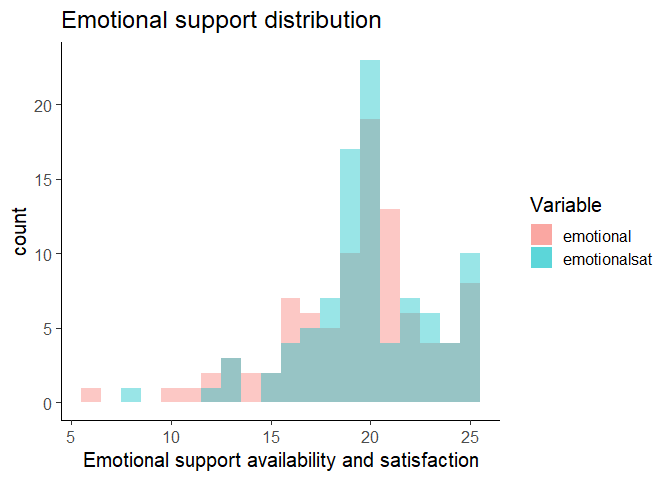
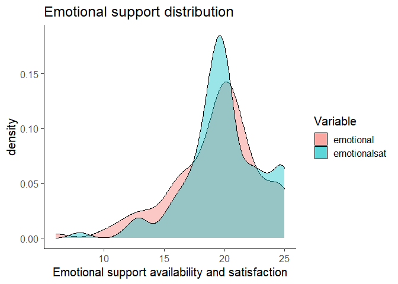
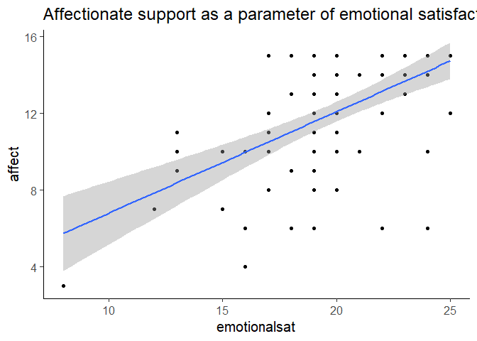
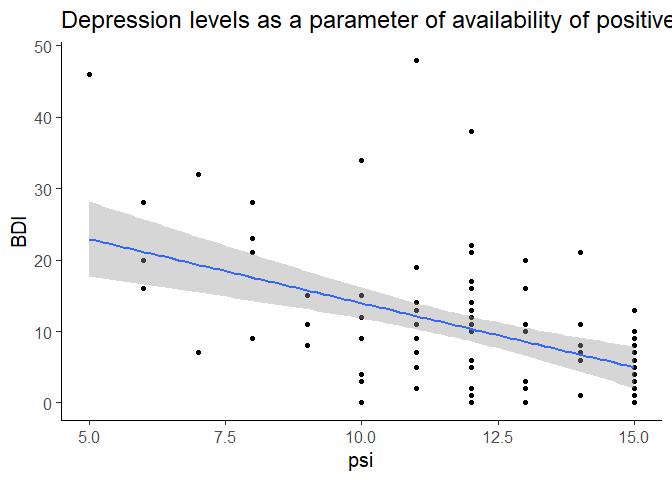
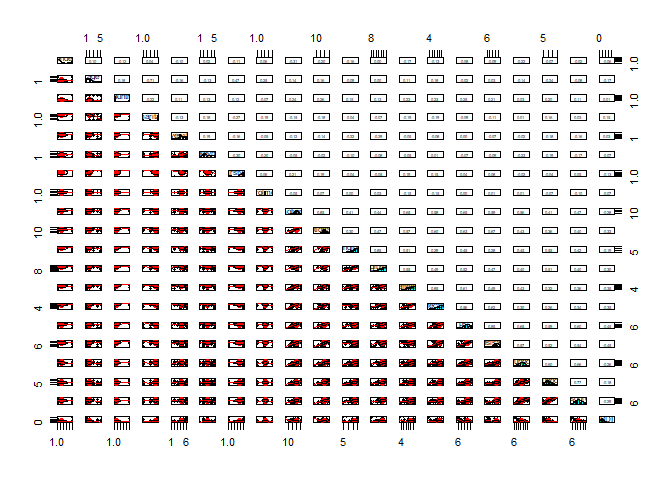

Final Exercise - Analyzing Social Support Dataset
=================================================

Question 1
----------

Question: **Using the helper function in R, identify the library where
your dataset is stored. Install relevant libraries and call your
dataset**. In order to find the source of our dataset, we used the
“findFn” function from the sos package:

    library("sos")

    ## Warning: package 'sos' was built under R version 4.0.5

    ## Loading required package: brew

    ## 
    ## Attaching package: 'sos'

    ## The following object is masked from 'package:utils':
    ## 
    ##     ?

    findFn("socsupport")

    ## found 2 matches
    ## Downloaded 2 links in 1 packages.

    ## Ignoring template.

    ## Warning in print.packageSum(pS): 0 bytes in file C:
    ## \Users\user\AppData\Local\Temp\RtmpcD9ldz\file5eb41f3f3247.html; nothing to give
    ## to a browser.

We will install the package “DAAG”:

    #install.packages("DAAG")

Question 2
----------

### Section A

Question: **What is the size of your dataset? What do the different
variables mean? Write a short description (1 line) per variable. You may
rely on any information you can find on the internet or use the helper
function in R**. 1. To find the size of the dataset, we will use the dim
function:

    library(DAAG)
    attach(socsupport)
    dim(socsupport)

    ## [1] 95 20

The socsupport dataset has 95 records with 20 variables.

1.  To find the description, we will use the R help operator - ?

<!-- -->

    ?socsupport

    ## starting httpd help server ... done

-   gender - a factor with levels female, male
-   age - age, in years, with levels 18-20, 21-24, 25-30, 31-40,40+
-   country - a factor with levels australia, other
-   marital - a factor with levels married, other, single
-   livewith - a factor with levels alone, friends, other, parents,
    partner, residences
-   employment - a factor with levels employed fulltime, employed
    part-time, govt assistance, other, parental support
-   firstyr - a factor with levels first year, other
-   enrolment - a factor with levels full-time, part-time, <NA>
-   emotional - summary of 5 questions on emotional support availability
-   emotionalsat - summary of 5 questions on emotional support
    satisfaction
-   tangible - summary of 4 questions on availability of tangible
    support
-   tangiblesat - summary of 4 questions on satisfaction with tangible
    support
-   affect - summary of 3 questions on availability of affectionate
    support sources
-   affectsat - summary of 3 questions on satisfaction with affectionate
    support sources
-   psi - summary of 3 questions on availability of positive social
    interaction
-   psisat - summary of 3 questions on satisfaction with positive social
    interaction
-   esupport - summary of 4 questions on extent of emotional support
    sources
-   psupport - summary of 4 questions on extent of practical support
    sources
-   supsources - summary of 4 questions on extent of social support
    sources (formerly, socsupport)
-   BDI - Score on the Beck depression index (summary of 21 questions)

### Section B

Question: **In one table, show the type, the minimum, the maximum, the
mean and the median (when relevant) of each variable**. To answer this,
first we will choose only the columns with numeric values.

    library(dplyr)

    ## Warning: package 'dplyr' was built under R version 4.0.5

    ## 
    ## Attaching package: 'dplyr'

    ## The following object is masked from 'package:sos':
    ## 
    ##     matches

    ## The following objects are masked from 'package:stats':
    ## 
    ##     filter, lag

    ## The following objects are masked from 'package:base':
    ## 
    ##     intersect, setdiff, setequal, union

    num_socs <- socsupport %>% select_if(is.numeric)

Next we will apply the summery function on each variable

    socs_stat_sum <- sapply(num_socs, summary)
    socs_type <- sapply(socsupport, class)

The output of the function is a list of vectors. We will convert it to a
dataframe and assign the names of the variables to the dataframe rows.

    socs_sum_df <- bind_rows(lapply(socs_stat_sum, as.data.frame.list))
    socs_type_df <- bind_rows(lapply(socs_type, as.data.frame.list))

    row.names(socs_sum_df) <- colnames(num_socs)
    row.names(socs_type_df) <- colnames(socsupport)

We will replace the factor with strings:

    socs_type_df$X.AsIs. <- as.character(socs_type_df$X.AsIs.)
    socs_type_df$X.factor. <- as.character(socs_type_df$X.factor.)
    socs_type_df$X.numeric. <- as.character(socs_type_df$X.numeric.)

Now we will replace the “NAs” with spaces, and concatenate them to a
single variable:

    socs_type_df[is.na(socs_type_df)] <- ""
    socs_type_df$Type = paste0(socs_type_df$X.AsIs., " ", socs_type_df$X.factor., socs_type_df$X.numeric.)

We will merge the numerical summary dataframe, and the type dataframe:

    socs_all_sum_df <- merge(socs_type_df, socs_sum_df, by = "row.names", all = TRUE)

Lastly, we will round the “Mean” column and select only the desired
fields:

    socs_all_sum_df$Mean = round(socs_all_sum_df$Mean, digits = 2)
    socs_all_sum_df %>% select(Row.names, Type, Min., Max., Mean, Median)

    ##       Row.names        Type Min. Max.  Mean Median
    ## 1        affect     numeric    3   15 11.99     13
    ## 2     affectsat     numeric    3   15 12.33     13
    ## 3           age AsIs factor   NA   NA    NA     NA
    ## 4           BDI     numeric    0   48 10.76      9
    ## 5       country AsIs factor   NA   NA    NA     NA
    ## 6     emotional     numeric    6   25 19.24     20
    ## 7  emotionalsat     numeric    8   25 19.88     20
    ## 8    employment      factor   NA   NA    NA     NA
    ## 9     enrolment AsIs factor   NA   NA    NA     NA
    ## 10     esupport     numeric    6   19 12.77     13
    ## 11      firstyr AsIs factor   NA   NA    NA     NA
    ## 12       gender AsIs factor   NA   NA    NA     NA
    ## 13     livewith AsIs factor   NA   NA    NA     NA
    ## 14      marital AsIs factor   NA   NA    NA     NA
    ## 15          psi     numeric    5   15 11.78     12
    ## 16       psisat     numeric    5   15 12.17     12
    ## 17     psupport     numeric    4   20 10.33     10
    ## 18   supsources     numeric    5   16 10.81     11
    ## 19     tangible     numeric    4   20 16.41     18
    ## 20  tangiblesat     numeric    8   20 17.01     18

### Section C

Question: **What is the average BDI score (depression index) per
country? Show your results in a table**. To answer this, we will group
the dataframe by country, and calculate the mean.

    bdi_comparison <- socsupport %>%
      group_by(country) %>%
      summarise(mean_bdi = mean(BDI, na.rm = T))

We will round the result to 2 digits:

    bdi_comparison$mean_bdi = round(bdi_comparison$mean_bdi, 2)
    bdi_comparison

    ## # A tibble: 2 x 2
    ##    country mean_bdi
    ##   <I<int>>    <dbl>
    ## 1        1     10.7
    ## 2        2     11

### Section D

Question: **Using the table from 1.c., plot the average BDI per
country**. We will use the geom\_col of the ggplot package (and convert
the country factor to a character-vector).

    library(ggplot2)

    ## Warning: package 'ggplot2' was built under R version 4.0.5

    ggplot(data = bdi_comparison, aes(x = as.character(country), y = mean_bdi)) +
      geom_col() +
      ggtitle("Mean BDI per country") +
      xlab("Country") +
      ylab("Mean BDI") +
      theme_classic(base_size = 15)

\#\#\# Section E Question: **Using a plot, what is the average BDI score
per country and per marital status**?  
We will group the dataframe by country and by marital status, and plot a
barplot:

    bdi_comparison_2 <- socsupport %>%
      group_by(country, marital) %>%
      summarise(mean_bdi = mean(BDI, na.rm = T))

    ## `summarise()` has grouped output by 'country'. You can override using the `.groups` argument.

    ggplot(data = bdi_comparison_2, aes(x = as.character(country), y = mean_bdi, fill = as.character(marital))) +
      geom_col(position = "dodge") +
      ggtitle("Mean BDI per country and merital status") +
      xlab("Country") +
      ylab("Mean BDI") +
      labs(fill = "Marital status") +
    theme_classic(base_size = 15)

The average BDI scores per country and per marital status are as follow:
For married people from Australia: About 8.5 For single people from
Australia: About 12 For people in other situation from Australia: About
7 For married people from other places: About 7.5 For single people from
other places: About 13 For people in other situation from other places:
About 6

Question 3
----------

### Section A

Question: **What is the distribution of “emotional” and “emotionalsat”?
Show it in a graph. What is the difference between these two
variables?** We will plot a histogram of the two variables( without the
NA values):

    socsupport %>%
      subset(!is.na(emotional)) %>%
      subset(!is.na(emotionalsat)) %>%
      ggplot() +
      geom_histogram(aes(x = emotional, fill = "blue"), binwidth = 1, alpha = 0.4) +
      geom_histogram(aes(x = emotionalsat, fill = "pink"), binwidth = 1, alpha = 0.4) +
      scale_fill_discrete(name = "Variable", labels = c("emotional", "emotionalsat")) +
      ggtitle("Emotional support distribution") +
      xlab("Emotional support availability and satisfaction") +
    theme_classic(base_size = 15)

To get better impression, we plot the density as well:

    socsupport %>%
      subset(!is.na(emotional)) %>%
      subset(!is.na(emotionalsat)) %>%
      ggplot() +
      geom_density(aes(x = emotional, fill = "blue"), alpha = 0.4) +
      geom_density(aes(x = emotionalsat, fill = "pink"), alpha = 0.4) +
      scale_fill_discrete(name = "Variable", labels = c("emotional", "emotionalsat")) +
      ggtitle("Emotional support distribution") +
      xlab("Emotional support availability and satisfaction") +
      theme_classic(base_size = 15)

It seems that the two variables have similar distribution, with a bit
higher pik in the 20 score of the emotionsat variable. According to the
documentaion, the emotional variable represents a summary of 5 questions
on emotional support **availability**, while the emotionalsat variable
represents a summary of 5 questions on emotional support
**satisfaction**.

### Section B

Question: **Using a statistical test of your choice, is there a
correlation between scores of emotional satisfaction and affectionate
support resources? Explain your method and show your result on a plot of
your choice.** The affectionate support resources are represented by the
“affect” variable, and the scores of emotional satisfaction are
represented by the emotionalsat variable. To answer this, we will first
test the pearson correlation:

    cor.test(socsupport$emotionalsat, socsupport$affect, method = "pearson")

    ## 
    ##  Pearson's product-moment correlation
    ## 
    ## data:  socsupport$emotionalsat and socsupport$affect
    ## t = 6.6366, df = 92, p-value = 2.185e-09
    ## alternative hypothesis: true correlation is not equal to 0
    ## 95 percent confidence interval:
    ##  0.4141181 0.6918479
    ## sample estimates:
    ##       cor 
    ## 0.5689924

Since the p-value of the test is 2.185e-09, which is less than the
significance level of 0.05, we conclude that the emotional satisfaction
and the affectionate support resources are significantly correlated with
a correlation coefficient of 0.57 and p-value of 2.185e-09. From that
reason we will not test the Spearman correlation. We will plot the
correlation using geom\_smooth:

    ggplot(socsupport, aes(x = emotionalsat, y = affect)) +
      geom_point() +
      geom_smooth(method = lm) +
      ggtitle("Affectionate support as a parameter of emotional satisfaction") +
    theme_classic(base_size = 15)

    ## `geom_smooth()` using formula 'y ~ x'

    ## Warning: Removed 1 rows containing non-finite values (stat_smooth).

    ## Warning: Removed 1 rows containing missing values (geom_point).

### Section C

Question: **Are social people (people with more positive interactions)
less likely to be depressed? You must answer this question using an
appropriate statistical test.** We will base our answer on the variables
**psi**, which represents a summary of 3 questions on availability of
positive social interaction, and **BDI**, which is the score on the Beck
depression index (summary of 21 questions). In order to choose the
appropriate test, we will test the type of these two variables:

    str(socsupport$psi)

    ##  num [1:95] 12 9 13 13 11 12 15 12 12 6 ...

    str(socsupport$BDI)

    ##  num [1:95] 5 8 16 0 9 0 1 14 12 20 ...

Since the two variables are quantitative variables, we will use a
correlation. We will start with the pearson correlation:

    cor.test(socsupport$BDI, socsupport$psi, method = "pearson")

    ## 
    ##  Pearson's product-moment correlation
    ## 
    ## data:  socsupport$BDI and socsupport$psi
    ## t = -4.8856, df = 93, p-value = 4.281e-06
    ## alternative hypothesis: true correlation is not equal to 0
    ## 95 percent confidence interval:
    ##  -0.5989192 -0.2754755
    ## sample estimates:
    ##        cor 
    ## -0.4519274

It seems that there is negative correlation (cor = -0.45) with
significant level of 4.281e-06, which is smaller than the significance
level of 0.05. We conclude that social people are indeed less likely to
be depressed.

### Section D

Question: **Show your results on a plot.** We will use the geom\_smooth
again:

    ggplot(socsupport, aes(x = psi, y = BDI)) +
      geom_point() +
      geom_smooth(method = lm) +
      ggtitle("Depression levels as a parameter of availability of positive social interaction") +
    theme_classic(base_size = 15)

    ## `geom_smooth()` using formula 'y ~ x'

Question 4
----------

Question: **Using all the variables at your disposition, write the best
model possible to explain depression scores. You can test as many models
as you want. In your code, you must show all the formulas you have tried
but you must only report the results for the best model. Why did you
choose that model over others?**

First we will test the correlation between the variables:

    library(psych)

    ## 
    ## Attaching package: 'psych'

    ## The following objects are masked from 'package:ggplot2':
    ## 
    ##     %+%, alpha

    pairs.panels(socsupport)

We can see that the BDI variable has the highest correlation with the
the psi and the psisat variables, which also correlates between them. So
our first model will depend on the psi variable:

    summary(lm(data = socsupport, BDI ~ psi))

    ## 
    ## Call:
    ## lm(formula = BDI ~ psi, data = socsupport)
    ## 
    ## Residuals:
    ##     Min      1Q  Median      3Q     Max 
    ## -13.956  -5.259  -0.765   3.544  35.842 
    ## 
    ## Coefficients:
    ##             Estimate Std. Error t value Pr(>|t|)    
    ## (Intercept)   31.935      4.423   7.220 1.39e-10 ***
    ## psi           -1.798      0.368  -4.886 4.28e-06 ***
    ## ---
    ## Signif. codes:  0 '***' 0.001 '**' 0.01 '*' 0.05 '.' 0.1 ' ' 1
    ## 
    ## Residual standard error: 8.57 on 93 degrees of freedom
    ## Multiple R-squared:  0.2042, Adjusted R-squared:  0.1957 
    ## F-statistic: 23.87 on 1 and 93 DF,  p-value: 4.281e-06

We can see that the R-squared is low - only 0.2, and the standard error
is high. We will try to depend out model on the “psisat” variable:

    summary(lm(data = socsupport, BDI ~ psisat))

    ## 
    ## Call:
    ## lm(formula = BDI ~ psisat, data = socsupport)
    ## 
    ## Residuals:
    ##     Min      1Q  Median      3Q     Max 
    ## -14.064  -5.899  -0.568   3.599  38.766 
    ## 
    ## Coefficients:
    ##             Estimate Std. Error t value Pr(>|t|)    
    ## (Intercept)  33.0605     4.6410   7.124 2.19e-10 ***
    ## psisat       -1.8328     0.3745  -4.894 4.14e-06 ***
    ## ---
    ## Signif. codes:  0 '***' 0.001 '**' 0.01 '*' 0.05 '.' 0.1 ' ' 1
    ## 
    ## Residual standard error: 8.567 on 93 degrees of freedom
    ## Multiple R-squared:  0.2048, Adjusted R-squared:  0.1963 
    ## F-statistic: 23.95 on 1 and 93 DF,  p-value: 4.137e-06

And on their combination:

    summary(lm(data = socsupport, BDI ~ psi + psisat))

    ## 
    ## Call:
    ## lm(formula = BDI ~ psi + psisat, data = socsupport)
    ## 
    ## Residuals:
    ##     Min      1Q  Median      3Q     Max 
    ## -12.646  -5.680   0.221   3.738  37.321 
    ## 
    ## Coefficients:
    ##             Estimate Std. Error t value Pr(>|t|)    
    ## (Intercept)  34.3197     4.7022   7.299 1.01e-10 ***
    ## psi          -0.9667     0.6857  -1.410    0.162    
    ## psisat       -1.0005     0.6980  -1.433    0.155    
    ## ---
    ## Signif. codes:  0 '***' 0.001 '**' 0.01 '*' 0.05 '.' 0.1 ' ' 1
    ## 
    ## Residual standard error: 8.522 on 92 degrees of freedom
    ## Multiple R-squared:  0.2216, Adjusted R-squared:  0.2047 
    ## F-statistic:  13.1 on 2 and 92 DF,  p-value: 9.881e-06

We can see that the R-squared is still low - only 0.2, and the standard
error is still high. We will try to improve the model by replacing the
psi with the affectsat variable, which has a correlation of 0.35 with
BDI:

    summary(lm(data = socsupport, BDI ~ psisat + affectsat))

    ## 
    ## Call:
    ## lm(formula = BDI ~ psisat + affectsat, data = socsupport)
    ## 
    ## Residuals:
    ##     Min      1Q  Median      3Q     Max 
    ## -14.678  -6.220  -0.139   3.669  37.698 
    ## 
    ## Coefficients:
    ##             Estimate Std. Error t value Pr(>|t|)    
    ## (Intercept)  34.2162     4.8121   7.110 2.43e-10 ***
    ## psisat       -1.5611     0.4773  -3.271  0.00151 ** 
    ## affectsat    -0.3620     0.3938  -0.919  0.36040    
    ## ---
    ## Signif. codes:  0 '***' 0.001 '**' 0.01 '*' 0.05 '.' 0.1 ' ' 1
    ## 
    ## Residual standard error: 8.574 on 92 degrees of freedom
    ## Multiple R-squared:  0.212,  Adjusted R-squared:  0.1949 
    ## F-statistic: 12.38 on 2 and 92 DF,  p-value: 1.735e-05

We can see that the R-squared decreased. We will try to replace the
psisat with the psisat variable:

    summary(lm(data = socsupport, BDI ~ psi + affectsat))

    ## 
    ## Call:
    ## lm(formula = BDI ~ psi + affectsat, data = socsupport)
    ## 
    ## Residuals:
    ##     Min      1Q  Median      3Q     Max 
    ## -12.200  -5.634  -0.200   3.268  35.021 
    ## 
    ## Coefficients:
    ##             Estimate Std. Error t value Pr(>|t|)    
    ## (Intercept)  33.9556     4.7121   7.206 1.56e-10 ***
    ## psi          -1.4938     0.4437  -3.367  0.00111 ** 
    ## affectsat    -0.4545     0.3726  -1.220  0.22569    
    ## ---
    ## Signif. codes:  0 '***' 0.001 '**' 0.01 '*' 0.05 '.' 0.1 ' ' 1
    ## 
    ## Residual standard error: 8.548 on 92 degrees of freedom
    ## Multiple R-squared:  0.2169, Adjusted R-squared:  0.1999 
    ## F-statistic: 12.74 on 2 and 92 DF,  p-value: 1.305e-05

We can see that the Adjusted R-squared got higher, but it is still less
than 0.2. So we will replace the affect variable with another variable.
We chose next the emotionalsat variable, which represents a summary of 5
questions on emotional support satisfaction and has a negative
correlation of 0.33 with BDI.

    summary(lm(data = socsupport, BDI ~ psi + emotionalsat))

    ## 
    ## Call:
    ## lm(formula = BDI ~ psi + emotionalsat, data = socsupport)
    ## 
    ## Residuals:
    ##     Min      1Q  Median      3Q     Max 
    ## -13.783  -5.535  -0.415   3.439  36.520 
    ## 
    ## Coefficients:
    ##              Estimate Std. Error t value Pr(>|t|)    
    ## (Intercept)   34.2568     5.7357   5.973 4.46e-08 ***
    ## psi           -1.6066     0.4751  -3.382  0.00106 ** 
    ## emotionalsat  -0.2320     0.3575  -0.649  0.51800    
    ## ---
    ## Signif. codes:  0 '***' 0.001 '**' 0.01 '*' 0.05 '.' 0.1 ' ' 1
    ## 
    ## Residual standard error: 8.635 on 91 degrees of freedom
    ##   (1 observation deleted due to missingness)
    ## Multiple R-squared:  0.2085, Adjusted R-squared:  0.1911 
    ## F-statistic: 11.98 on 2 and 91 DF,  p-value: 2.399e-05

We find that the Adjusted R-squared decreased again, and the standard
error increased. We replaced the emotional with supsources, which
represents a summary of 4 questions on extent of social support sources.

    summary(lm(data = socsupport, BDI ~ psi + supsources))

    ## 
    ## Call:
    ## lm(formula = BDI ~ psi + supsources, data = socsupport)
    ## 
    ## Residuals:
    ##     Min      1Q  Median      3Q     Max 
    ## -14.466  -5.289  -0.776   3.589  35.811 
    ## 
    ## Coefficients:
    ##             Estimate Std. Error t value Pr(>|t|)    
    ## (Intercept) 32.85076    4.82700   6.806 1.09e-09 ***
    ## psi         -1.77867    0.47033  -3.782  0.00028 ***
    ## supsources  -0.09964    0.46772  -0.213  0.83179    
    ## ---
    ## Signif. codes:  0 '***' 0.001 '**' 0.01 '*' 0.05 '.' 0.1 ' ' 1
    ## 
    ## Residual standard error: 8.668 on 90 degrees of freedom
    ##   (2 observations deleted due to missingness)
    ## Multiple R-squared:  0.2113, Adjusted R-squared:  0.1937 
    ## F-statistic: 12.05 on 2 and 90 DF,  p-value: 2.301e-05

We find that the Adjusted R-squared increased than last model, but it is
still lower than with the psi alone. We replaced the supsourced variable
with “tangiblesat”, which represents a summary of 4 questions on
satisfaction with tangible support:

    summary(lm(data = socsupport, BDI ~ psi + tangiblesat))

    ## 
    ## Call:
    ## lm(formula = BDI ~ psi + tangiblesat, data = socsupport)
    ## 
    ## Residuals:
    ##     Min      1Q  Median      3Q     Max 
    ## -15.023  -5.335  -0.618   3.368  34.410 
    ## 
    ## Coefficients:
    ##             Estimate Std. Error t value Pr(>|t|)    
    ## (Intercept)  35.5350     5.6422   6.298 1.12e-08 ***
    ## psi          -1.7016     0.4365  -3.898 0.000188 ***
    ## tangiblesat  -0.2689     0.3591  -0.749 0.455933    
    ## ---
    ## Signif. codes:  0 '***' 0.001 '**' 0.01 '*' 0.05 '.' 0.1 ' ' 1
    ## 
    ## Residual standard error: 8.581 on 89 degrees of freedom
    ##   (3 observations deleted due to missingness)
    ## Multiple R-squared:  0.2251, Adjusted R-squared:  0.2077 
    ## F-statistic: 12.93 on 2 and 89 DF,  p-value: 1.179e-05

We can see that Adjusted R-squared increased a bit, and it is even
higher than the first model, in which the R-squared had the value of
2.047. We will try to improve this last model by adding the variable
that represent a summary of 5 questions on emotional support
availability:

    summary(lm(data = socsupport, BDI ~ psi + tangiblesat + emotional))

    ## 
    ## Call:
    ## lm(formula = BDI ~ psi + tangiblesat + emotional, data = socsupport)
    ## 
    ## Residuals:
    ##     Min      1Q  Median      3Q     Max 
    ## -15.347  -5.253  -0.870   3.149  34.052 
    ## 
    ## Coefficients:
    ##             Estimate Std. Error t value Pr(>|t|)    
    ## (Intercept)  34.8280     6.0344   5.772 1.16e-07 ***
    ## psi          -1.8008     0.5257  -3.426 0.000934 ***
    ## tangiblesat  -0.2880     0.3652  -0.789 0.432388    
    ## emotional     0.1136     0.3317   0.343 0.732765    
    ## ---
    ## Signif. codes:  0 '***' 0.001 '**' 0.01 '*' 0.05 '.' 0.1 ' ' 1
    ## 
    ## Residual standard error: 8.624 on 88 degrees of freedom
    ##   (3 observations deleted due to missingness)
    ## Multiple R-squared:  0.2261, Adjusted R-squared:  0.1997 
    ## F-statistic: 8.571 on 3 and 88 DF,  p-value: 4.701e-05

We see that the Adjusted R-squared decreased again. We tried to remove
the psi variable and base our model on 2 other variables that correlate
with BDI - the affects at and emotional sat variables.

    summary(lm(data = socsupport, BDI ~ affectsat + emotionalsat))

    ## 
    ## Call:
    ## lm(formula = BDI ~ affectsat + emotionalsat, data = socsupport)
    ## 
    ## Residuals:
    ##     Min      1Q  Median      3Q     Max 
    ## -13.428  -5.993  -1.603   3.211  36.636 
    ## 
    ## Coefficients:
    ##              Estimate Std. Error t value Pr(>|t|)    
    ## (Intercept)   31.7893     5.8936   5.394 5.42e-07 ***
    ## affectsat     -0.7815     0.4099  -1.906   0.0597 .  
    ## emotionalsat  -0.5732     0.3627  -1.580   0.1175    
    ## ---
    ## Signif. codes:  0 '***' 0.001 '**' 0.01 '*' 0.05 '.' 0.1 ' ' 1
    ## 
    ## Residual standard error: 8.984 on 91 degrees of freedom
    ##   (1 observation deleted due to missingness)
    ## Multiple R-squared:  0.1432, Adjusted R-squared:  0.1244 
    ## F-statistic: 7.606 on 2 and 91 DF,  p-value: 0.0008817

We found that the Adjusted R-squared decreased to 0.12. We chose to stay
with the model that is based on the variable “psi”, which represents a
summary of 3 questions on availability of positive social interaction,
and the variable “tangiblesat”, which stands for a summary of 4
questions on satisfaction with tangible support:

    summary(lm(data = socsupport, BDI ~ psi + tangiblesat))

    ## 
    ## Call:
    ## lm(formula = BDI ~ psi + tangiblesat, data = socsupport)
    ## 
    ## Residuals:
    ##     Min      1Q  Median      3Q     Max 
    ## -15.023  -5.335  -0.618   3.368  34.410 
    ## 
    ## Coefficients:
    ##             Estimate Std. Error t value Pr(>|t|)    
    ## (Intercept)  35.5350     5.6422   6.298 1.12e-08 ***
    ## psi          -1.7016     0.4365  -3.898 0.000188 ***
    ## tangiblesat  -0.2689     0.3591  -0.749 0.455933    
    ## ---
    ## Signif. codes:  0 '***' 0.001 '**' 0.01 '*' 0.05 '.' 0.1 ' ' 1
    ## 
    ## Residual standard error: 8.581 on 89 degrees of freedom
    ##   (3 observations deleted due to missingness)
    ## Multiple R-squared:  0.2251, Adjusted R-squared:  0.2077 
    ## F-statistic: 12.93 on 2 and 89 DF,  p-value: 1.179e-05

Done.
